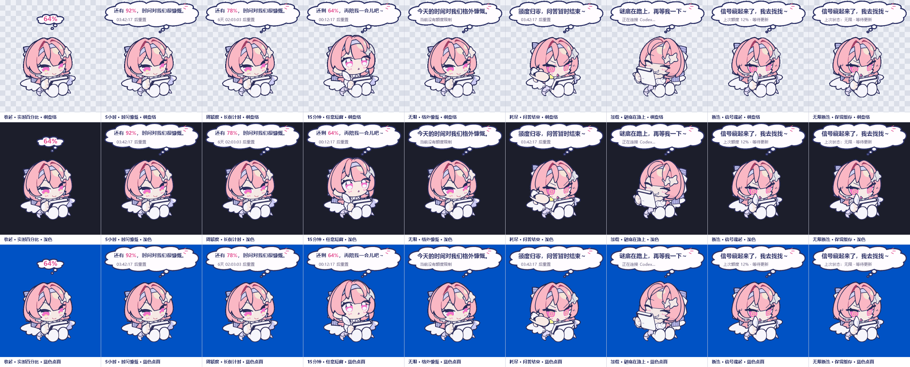

# Codex 额度桌宠

一个透明、置顶、可拖动的 Windows 桌宠，通过角色头顶的云朵思考气泡显示 Codex 当前最短额度窗口和重置倒计时。

## 使用方式

- 平时头顶小气泡显示剩余百分比；鼠标悬停后会展开完整额度对白，移开约 2 秒后收起。
- 单击后角色会开心回应，并让完整气泡至少停留 5 秒。
- 左键拖动桌宠可改变位置。
- 双击桌宠可打开 Codex Usage 页面。
- 右键桌宠或托盘图标可立即刷新、切换鼠标穿透、重置位置、控制开机自启、隐藏或退出。
- 托盘图标双击可隐藏或重新显示桌宠。
- 连续 45–90 秒没有互动时，角色会随机进入一次 5 秒打哈欠动作。

## 云朵思考气泡

- 展开时使用八瓣云朵和三颗思考圆点；收起时使用六瓣小云朵和两颗圆点。
- 气泡使用白底、深蓝描边和粉色百分比，没有进度条或“5小时额度”标题；外层底描边用于避免透明窗口产生绿色或白色晕边。
- 展开对白采用蕾米埃尔式的温柔、神秘口吻：额度充足时感叹时间慷慨，中等时邀请再陪一会，偏低时提醒不要勉强，严重不足时建议留给重要的事，耗尽时结束本轮问答。
- 加载时显示“谜底在路上，再等我一下～”；连接异常时显示“信号藏起来了，我去找找～”，有缓存时继续保留上次额度。
- 后台每分钟刷新只更新小气泡数字，不会主动展开完整气泡。
- 额度窗口名称不占用气泡正文；将鼠标停在桌宠上或查看托盘提示可看到“当前显示：5小时额度 / 周额度 / N天额度 / N小时额度 / N分钟额度”。
- 一天以内显示 `HH:MM:SS 后重置`，一天以上显示 `N天 HH:MM:SS 后重置`。
- 若官方响应明确表示当前没有额度窗口，小气泡显示 `∞`，展开时显示“今天的时间对我们格外慷慨。”和“当前没有额度限制”。

## GIF 透明边缘

- 六个 GIF 已逐帧移除最外侧 1–2 层中性白底消边像素，并将残余淡紫混色恢复为相邻的深色轮廓；原始 360×360 尺寸、17–61 帧、60–70ms 帧速和无限循环保持不变。
- 源码包中的 `OriginalAssets` 保存原始素材，`Assets` 保存清理后的 360×360 母版，`DisplayAssets` 保存程序实际嵌入的 240×240 等尺寸动画。
- 运行时使用等尺寸动画并关闭 `PictureBox` 缩放，避免角色边缘与透明窗体色键发生插值混色。
- 普通构建不依赖 Python。只有重新执行 `tools/clean_gif_edges.py` 时才需要 Pillow 和 NumPy。

## 动作含义

- `01.gif`：慌乱，当前显示的额度为 0%；这是最高优先级状态。
- `02.gif`：眩晕，额度低于 15% 或连接异常、数据陈旧。
- `03.gif`：专注阅读，首次连接、手动刷新或重置后重新读取。
- `04.gif`：打哈欠，额度较低或长时间没有互动。
- `05.gif`：抬头注意，额度中等、鼠标悬停、拖动或双击。
- `06.gif`：开心书写，额度充足、读取成功、单击或拖动完成。

临时互动不会覆盖“额度为 0%”或“连接异常”等重要状态。开启鼠标穿透后，桌宠不会接收悬停、点击和拖动动作；可以从托盘菜单关闭鼠标穿透。

## 额度来源

程序启动本机已经安装并登录的 `codex app-server`，读取官方的 `account/rateLimits/read` 响应，并监听 `account/rateLimits/updated`。通知到达后会重新完整读取一次，不会直接用可能不完整的通知片段切换窗口。程序不抓取网页、不要求 API Key，也不会读取、复制或保存 Codex 登录凭据。

选择规则如下：

1. 若 `rateLimitsByLimitId.codex` 主桶存在有效的 `primary` / `secondary` 窗口，从中选择 `windowDurationMins` 最小者；相同时优先 `primary`。
2. 若 `codex` 主桶缺失或没有有效窗口，再扫描其他桶，按窗口时长、`primary` 优先级和桶 ID 固定排序选择。
3. 多桶字段不存在时，兼容旧版 `rateLimits` 单桶；多桶字段存在时不与旧字段合并。

选择依据是窗口总时长，不是剩余时间、重置时间或剩余百分比。程序仍不显示积分余额或免费重置次数。

无限状态采用严格判定：只有成功响应明确给出空桶集合、`rateLimits: null`，或主/次窗口均明确为 `null` 时才显示 `∞`；缺字段、类型损坏或登录失败仍按异常处理。连接中断时会保留最后一次结果；无限缓存显示 `∞!` 和“上次状态：无限 · 等待更新”。

## 安装与卸载

运行 `Install-CodexQuotaPet.ps1` 将程序安装到 `%LOCALAPPDATA%\CodexQuotaPet`，创建桌面快捷方式并启用当前用户的开机自启。

运行 `Uninstall-CodexQuotaPet.ps1` 会退出桌宠，删除对应的启动项、桌面快捷方式和安装目录。卸载不会修改 Codex 本体、Codex 登录信息或其他宠物。

## 依赖

- Windows 10 或更高版本
- .NET Framework 4.8
- 已安装并已通过 ChatGPT 登录的当前版 Codex CLI

若桌宠提示找不到 Codex CLI 或无法读取额度，请先在终端运行 `codex --version` 并确认 Codex 登录状态。
